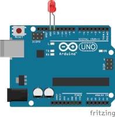
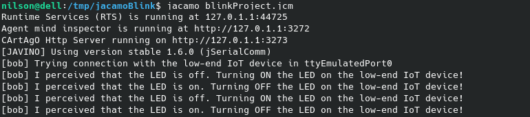
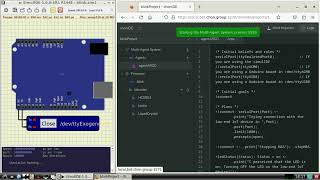

|[Home](../../)|[Prototypes](../)|[Tools](../../tools/)|
|--------------| ----------------|---------------------|

# Arduino Blink Project


---
- Reasoning layer

    In this project the agent turn an LED ON and OFF every reasoning circle.

    - [Blink Projet](files/reasoning/chonIDE/blinkProject.chon) for ChonIDE.
    - [Blink Project](../../../../raw/main/prototypes/arduinoBlink/files/reasoning/jacamoBlink.zip) for JaCaMo.
    - [Blink Project](../../../../raw/main/prototypes/arduinoBlink/files/reasoning/jasonEmbeddedBlink.zip) for JasonEmbedded.

    

- Interfacing layer
    
    The low-end IoT device provide the follow perceptions and support the actions below: 

    
    Percepts:
    ```
    ledStatus(on|off)               //the LED status
    ```

    Actions:
    ```
    ledOn                           //turn ON  the LED
    ledOff                          //turn OFF the LED
    ```
- Firmware layer
    - [Project using Arduino](../../../../raw/main/prototypes/arduinoBlink/files/firmware/arduinoBlink.zip)

- Hardware Layer
    - [Schematic Project](../../../../raw/main/prototypes/arduinoBlink/files/hardware/blinkschematic.fzz) using Fritzing.
    - [Simulation Project](../../../../raw/main/prototypes/arduinoBlink/files/hardware/blinkSimulation.zip) using SimulIDE.

---
### Demonstration
[](https://youtu.be/WbX-HOahMkc)