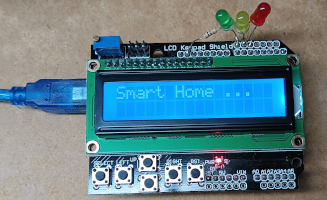
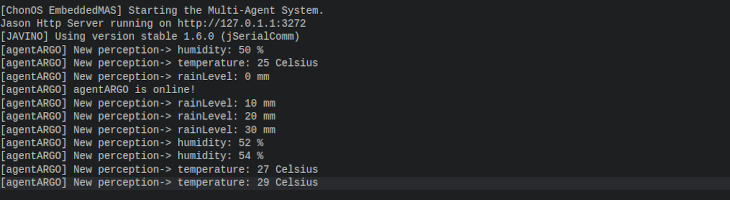
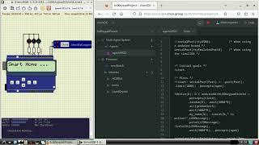

|[Home](../../)|[Prototypes](../)|[Tools](../../tools/)|
|--------------| ----------------|---------------------|

# Arduino LCD Keypad Project


---
- Reasoning layer

    In this project the agent turn an LED ON and OFF every reasoning circle.

    - [Blink Projet](files/reasoning/chonIDE/lcdKeypadProject.chon) for ChonIDE.
    - [Blink Project](../../../../raw/main/prototypes/arduinoLCDKeypadShield/files/reasoning/jacamoLCDKeypad.zip) for JaCaMo.
    - [Blink Project](../../../../raw/main/prototypes/arduinoLCDKeypadShield/files/reasoning/jasonEmbeddedLCDKeypad.zip) for JasonEmbedded.

    

- Interfacing layer
    
    The low-end IoT device provide the follow perceptions and support the actions below: 

    
    Percepts:
    ```
    device(arduinoWithLCDKeypadShield)[source(percept)].    // the device name
    humidity(H)[source(percept)].                           // H is a Integer
    rainLast24hrs(R)[source(percept)].                      // R is a Integer
    temperature(T)[source(percept)].                        // T is a Integer
    ```

    Actions:
    ```
    .act(redAlert)              // turn on the RED LED         
    .act(yellowAlert)           // turn on the YELLOW LED
    .act(greenAlert)            // turn on the GREEN LED
    .act(alertOff)              // turn off all LED
    .act(M)                     // print the String M in the LCD Display

    ```
- Firmware layer
    - [Project using Arduino](../../../../raw/main/prototypes/arduinoLCDKeypadShield/files/firmware/arduinoLCDKeypadShield.zip)

- Hardware Layer
    - [Simulation Project](../../../../raw/main/prototypes/arduinoLCDKeypadShield/files/hardware/arduinoLCDKeypadShieldSimulation.zip) using SimulIDE.

---
### Demonstration
[](https://youtu.be/JMDRFPLhH4w)