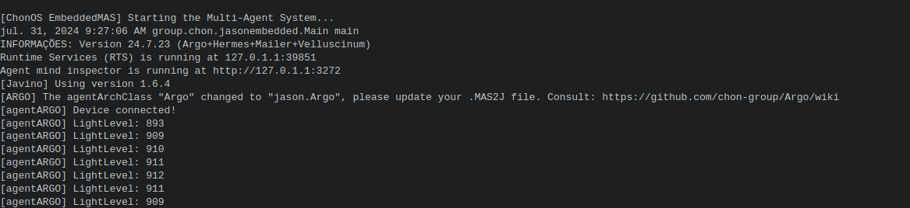

|[Home](../../)|[Prototypes](../)|[Tools](../../tools/)|
|--------------| ----------------|---------------------|

# Arduino Light Sensor Project


---
- Reasoning layer

    In this project the agent perceive the light level every reasoning circle.

    - [LDRSensor Projet](files/reasoning/chonIDE/ldrSensor.chon) for ChonIDE.
    - [LDRSensor Project](../../../../raw/main/prototypes/arduinoLDRsensor/files/reasoning/jacamoLDRSensor.zip) for JaCaMo.
    - [LDRSensor Project](../../../../raw/main/prototypes/arduinoLDRsensor/files/reasoning/jasonEmbeddedLDRSensor.zip) for JasonEmbedded.

    

- Interfacing layer
    
    The low-end IoT device provide the follow perceptions below: 

    
    Percepts:
    ```	
    device(arduinoLightSensor)     // device name
    lightSensor(L)                 // L is a Integer
    ```

- Firmware layer
    - [Project using Arduino](../../../../raw/main/prototypes/arduinoLDRsensor/files/firmware/ldrSensor.zip)

- Hardware Layer
    - [Simulation Project](../../../../raw/main/prototypes/arduinoLDRsensor/files/hardware/ldrSimulation.zip) using SimulIDE.

---
### Demonstration
TODO
[]()
