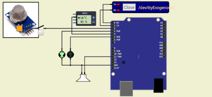
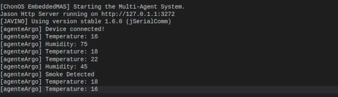

|[Home](../../)|[Prototypes](../)|[Tools](../../tools/)|
|--------------| ----------------|---------------------|

# Arduino Smoke and Temperature Project


---
- Reasoning layer

    In this project the agent turn an LED ON and OFF every reasoning circle.

    - [Blink Projet](files/reasoning/chonIDE/smokeAndTempProject.chon) for ChonIDE.
    - [Blink Project](../../../../raw/main/prototypes/arduinoSmokeAndTemperatureDetection/files/reasoning/jacamoSmokeAndTemperature.zip) for JaCaMo.
    - [Blink Project](../../../../raw/main/prototypes/arduinoSmokeAndTemperatureDetection/files/reasoning/jasonEmbeddedSmokeAndTemperature.zip) for JasonEmbedded.

    

- Interfacing layer
    
    The low-end IoT device provide the follow perceptions and support the actions below: 

    
    Percepts:
    ```	
    device(smokeAndTemperatureDetector)     // device name
    smoke(true|false)                       // smoke sensor perception
    temperature(T)                          // T is a Integer
    humidity(H)                             // H is a Integer
    ```

    Actions:
    ```
    .act(alert)             // turn on the GREEN LED         
    .act(standby)           // turn on the RED LED and the Buzzer

    ```
- Firmware layer
    - [Project using Arduino](../../../../raw/main/prototypes/arduinoSmokeAndTemperatureDetection/files/firmware/arduinoSmokeAndTemperatureDetection.zip)

- Hardware Layer
    - [Simulation Project](../../../../raw/main/prototypes/arduinoSmokeAndTemperatureDetection/files/hardware/smokeAndTemperatureDetectionSimulation.zip) using SimulIDE.

---
